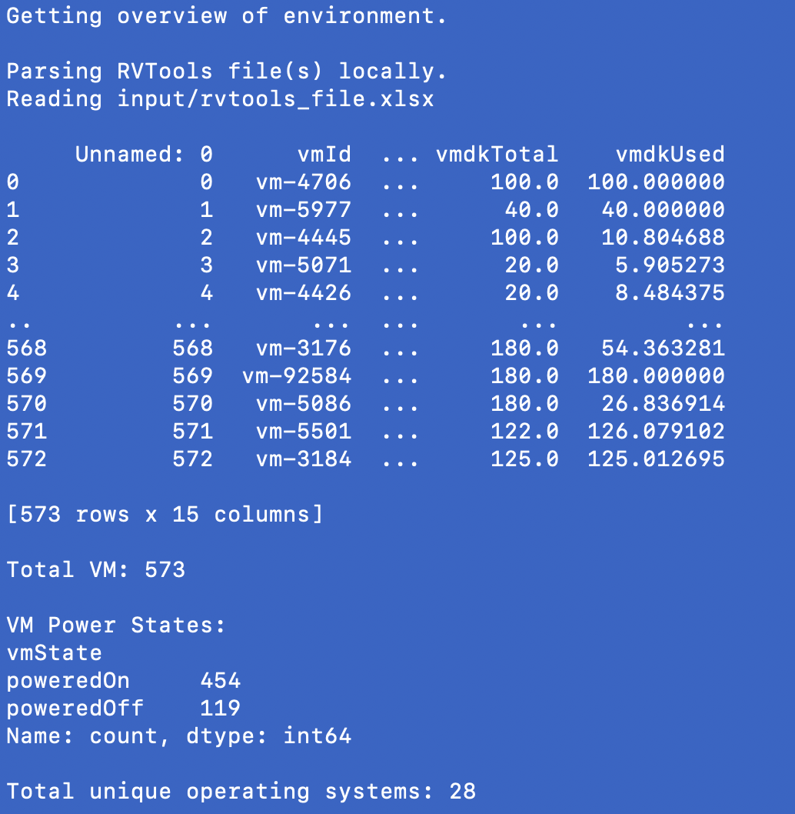
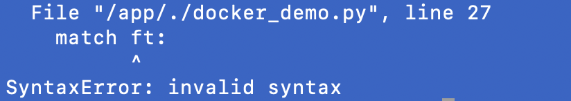

# docker-demo
This tool is used to demonstrate the use of environment versioning using python in a Docker image.  
The script will read a XLSX file, and print out a summary of the contents of the file.

**The script has MATCH statements that require Python 3.10 or later, but can be used with IF / ELSE statements when used with Python 3.9 or earlier.**

## How to use with Python 3.9 or Earlier
- uncomment / enable line 2 of Dockerfile
- comment / disable line 3 of Dockerfile
- be sure lines 18-23 of docker_demo.py are in use / enabled
- be sure lines 27-31 of docker_demo.py are commented / not in use

## How to use with Python 3.10 or later
- comment / disable line 2 of Dockerfile
- uncomment / enable line 3 of Dockerfile
- be sure lines 18-23 of docker_demo.py are commented / not in use
- be sure lines 27-31 of docker_demo.py are in use / enabled

## Building and running the container
- Install Docker Desktop on your workstation
- From within the same directory, run thefollowing command:
```
docker build -t USER OR REPO NAME/IMAGE NAME:tag .
```
for example:\n
```docker build -t fr0gger03/readfile-app:python-3.10 .```

## Push to Docker Hub
```docker push USER OR REPO NAME/IMAGE NAME:tag```
for example
```docker push fr0gger03/readfile-app:python-3.10```

## Run your container!
```docker run --rm USER OR REPO NAME/IMAGE NAME:tag```
for example:
```docker run fr0gger03/readfile-app:python-3.10```

A successful execution should appear as follows:


Once you have enabled the MATCH statements as above for python 3.10, if you execute without also updating the Dockerfile, the script will fail with the following error:
